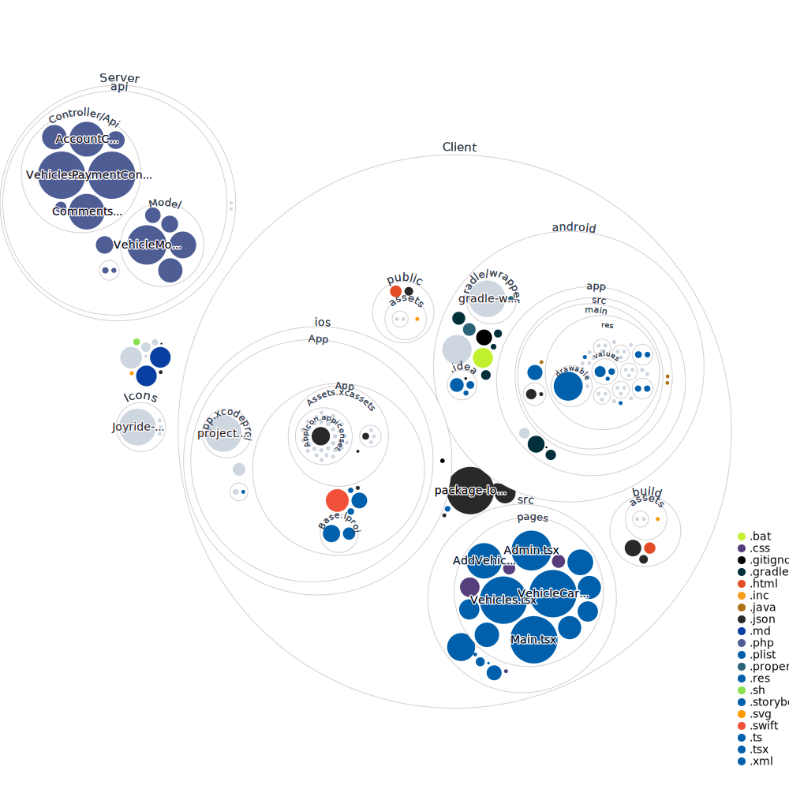

# Joyride
USER DOCUMENTATION

## Table of Contents
1. [Introduction](#intro)
2. [Setup](#set)
3. [Technologies](#tech)
4. [Features](#feat)
5. [Project Status](#status)

## Introduction 
Welcome to the Joyride Application, in this document you will find out more information on how to use our application to its full potential. The primary goal of our application
is to make buying and selling cars a more fluid and enjoyable experience. With our application a user will be able to log in and then see a library of cars that contain user
ratings and then be able to make purchases. A helpful feature that we are including with our project is the ability to filter through different vehicle types and the ability to
filter by rating as well. Being able to see the different ratings will make the user more able to find a car that is enjoyable for their rental. 

## Setup
There is no necessary downloads when trying to use Joyride. We wanted to create an application that is easy to use and makes the car rental experience more of a positive experience.  Joyride is accessible through a web browser, as well as being accessible on both IOS and Andriod. Joyride is accessible
for both guests, as well as registered users who sign up with an email and password. Joyride also has verification statuses for moderators and admins.

## Technologies
This project is created with:
* TypeScript
* PHP
* HTML
* CSS
* Swift
* Ruby

## Features
* ACCOUNT CREATION:
* Registration feature for customers to create an account for Joyride.
* We will have different types of users within our application.
* There are the standard user, admins and moderators.
* All will have different features that they will have accsess to. 
* Admins and moderators will be able to change some parts of the site.
* Regular users will not have too much power as they could try to change the site in a negative way.
* FILTER:
* Filter system that allows users to search for specfic vehicle specifications.
* We intend to have many different categories to filter by.
* The user will be able to filter by make and model.
* They can also be able to filter by year. 
* Additional categories that are filterable include through many popular features.
* Favorites feature where registered users can favorite vehicles
* Review system to allow users to leave reviews on select vehicles
* Moderators can verfiy any reviews left by users
* Admins can verfiy vehicles posted for rent on Joyride

## Project Status
This project is currently still under devlopment. The project has been through three main iterations, and we met all our deadlines. You can now enjoy the best experience that you have ever had while renting a car at https://joyride.kianm.net.

